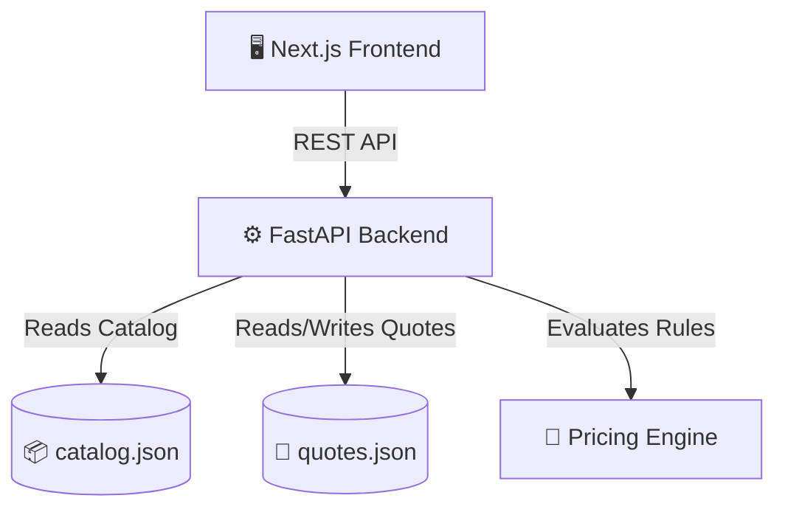

<div align="center">
  <h1>💼 Deal Desk Quote Simulator</h1>
  <p><strong>A modern, interactive tool for sales teams, deal desks, and rev-ops professionals.</strong></p>

  <p>
    
    
    
    
  </p>
</div>

<br />

Welcome to the **Deal Desk Quote Simulator**, an interactive MVP that provides a sleek web interface for calculating software quotes, applying volume discounts, and enforcing deal approval workflows. 

---

## ✨ Key Features

| Feature | Description |
| :--- | :--- |
| 🎨 **Modern Enterprise UI** | A premium, responsive interface with instant feedback, micro-animations, and a sticky summary card for real-time viewing. |
| 🧠 **Dynamic Pricing Engine** | Automatically calculates volume-based tier discounts based on seat count and applied rules. |
| ⚡ **Real-Time Calculation** | As items and seat requirements change, the quote recalculates instantly via the backend API. |
| 🛡️ **Automated Approvals** | Enforces business rules seamlessly. Manual discounts exceeding predefined thresholds are flagged automatically. |
| 📁 **Quote Management** | Save quotes as drafts, submit them for review, and transition them (`draft` ➔ `submitted` ➔ `approved`/`rejected`). |

---

## 🏗️ Architecture

The project is split into a robust backend API and a dynamic frontend application.



### 🧰 Technology Stack

- **Frontend:** Next.js (React), Vanilla CSS (Custom Theming), Fetch API
- **Backend:** FastAPI (Python), Pydantic (Validation), Pytest (Testing)
- **Data:** File-based JSON persistence (MVP)

---

## 🚀 Setup Instructions

### 📋 Prerequisites
- **Node.js**: v18+
- **Python**: 3.9+

### 💻 Frontend Setup

1. Navigate to the frontend directory:
   ```bash
   cd frontend
   ```
2. Install dependencies:
   ```bash
   npm install
   ```
3. Run the development server:
   ```bash
   npm run dev
   ```
> 🌐 The web app will be accessible at [http://localhost:3000](http://localhost:3000).

### ⚙️ Backend Setup

1. Navigate to the backend directory:
   ```bash
   cd backend
   ```
2. Create and activate a virtual environment:
   ```bash
   # MacOS / Linux
   python -m venv venv
   source venv/bin/activate  
   
   # Windows
   venv\Scripts\activate
   ```
3. Install dependencies:
   ```bash
   pip install -r requirements.txt
   ```
4. Start the API server:
   ```bash
   uvicorn app.main:app --reload
   ```
> 🔗 The API runs on [http://localhost:8000](http://localhost:8000).  
> 📚 View Swagger UI docs at `http://localhost:8000/docs`.

---

## 🧪 Testing

To run the backend business logic tests, use `pytest`:
```bash
cd backend
pytest
```

---

## 🔌 API Endpoints

The FastAPI backend exposes the following RESTful endpoints:

| Method | Endpoint | Description |
| :--- | :--- | :--- |
| `GET` | `/api/catalog` | 📦 Retrieve products, SKUs, and discount rules |
| `POST` | `/api/quotes/calculate` | 🧮 Submit items to preview calculations and approvals |
| `POST` | `/api/quotes` | 💾 Save a new quote |
| `GET` | `/api/quotes` | 📋 List all saved quotes |
| `GET` | `/api/quotes/{id}` | 🔍 Get details of a specific quote |
| `PATCH`| `/api/quotes/{id}/status`| 🔄 Transition a quote's status (e.g., approve/reject) |

---

## 🔮 Future Scope & Limitations

This is an **MVP** (Minimum Viable Product). Key areas for future improvement include:
- 🗄️ **Database Persistence**: Replacing `quotes.json` with PostgreSQL for thread safety and scalability.
- 🔐 **Auth & Authorization**: Adding roles (Sales Rep vs. Deal Desk Approver) and secure authentication.
- 📝 **Audit Logs**: Tracking who changed quote statuses and when.
